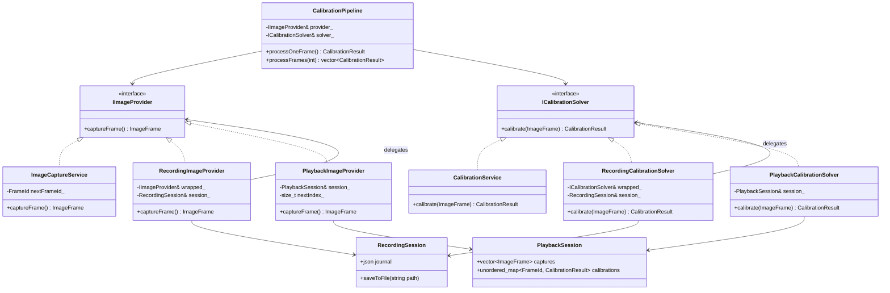
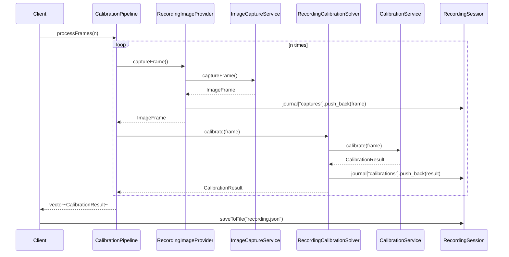
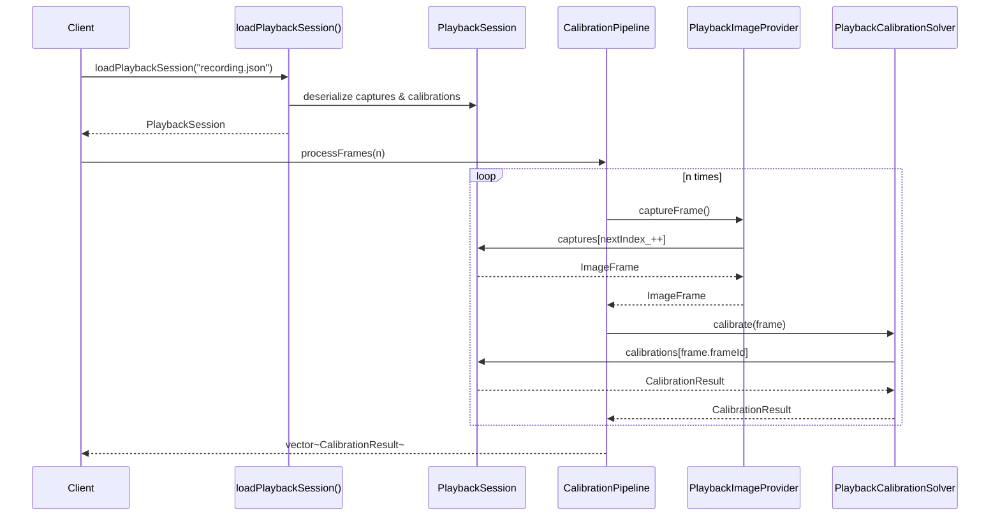

# Car Camera Calibration Serialization Demo

An educational C++17 project demonstrating the **Decorator Pattern** for serialization and deserialization using JSON. This project teaches how to intercept function calls, record their inputs/outputs, and later replay them without executing the original components.

## Overview

The project models a real-world car camera calibration system with three core components:

- **Component A: `ImageCaptureService`** — Captures frames from a vehicle's camera
- **Component B: `CalibrationService`** — Computes camera calibration parameters from frames
- **Component C: `CalibrationPipeline`** — Orchestrates the workflow: capture a frame, calibrate it, repeat

The key learning: how to add recording/playback capabilities without modifying these core components.

---

## The Three Scenarios

### Scenario 1: Direct Execution (No Recording)
```
CalibrationPipeline
    ├── ImageCaptureService (real)
    └── CalibrationService (real)
```
- Baseline behavior: direct calls to A and B
- No side effects, no recording
- Tests: `DirectPipelineTest`

### Scenario 2: Recording with Decorators
```
CalibrationPipeline
    ├── RecordingImageProvider ──delegates──> ImageCaptureService (real)
    └── RecordingCalibrationSolver ──delegates──> CalibrationService (real)
```
- Decorator wrappers intercept calls
- Each call is delegated to the real service AND recorded to JSON
- Results: `calibration_recording.json` with all inputs/outputs
- Tests: `RecordingTest`, `MockBasedRecordingTest`

### Scenario 3: Playback from Recording
```
CalibrationPipeline
    ├── PlaybackImageProvider (loads from JSON)
    └── PlaybackCalibrationSolver (loads from JSON)
```
- No real services are called
- Data comes from previously recorded JSON
- Enables deterministic testing and debugging
- Tests: `PlaybackTest`

---

## Architecture

### Core Types (`src/types.hpp`)
```cpp
using FrameId = int;

struct ImageFrame {
    FrameId frameId;
    std::string scene;
    double exposure;
};

struct CalibrationResult {
    FrameId frameId;
    double focalLength;
    double principalX;
    double principalY;
    double reprojectionError;
};
```
Both are JSON-serializable via `NLOHMANN_DEFINE_TYPE_NON_INTRUSIVE`, which generates `to_json`/`from_json` automatically.

### Interfaces (`src/interfaces.hpp`)
```cpp
struct IImageProvider {
    virtual ImageFrame captureFrame() = 0;
};

struct ICalibrationSolver {
    virtual CalibrationResult calibrate(const ImageFrame&) = 0;
};
```
These define the contract that recorders and players implement.

### Real Components (`src/components.hpp`)
- `ImageCaptureService`: generates synthetic frames with increasing exposure
- `CalibrationService`: computes focal length and principal point based on frame data

### Recording Decorators (`src/recorders.hpp`)
- `RecordingImageProvider`: wraps `IImageProvider`, records all captured frames
- `RecordingCalibrationSolver`: wraps `ICalibrationSolver`, records all calibration results
- `RecordingSession`: holds the JSON journal with captures and calibrations

Example:
```cpp
RecordingSession session;
RecordingImageProvider recordCapture(realCapture, session);
CalibrationPipeline pipeline(recordCapture, realSolver);
pipeline.processFrames(5);
session.saveToFile("recording.json");
```

### Playback Components (`src/players.hpp`)
- `PlaybackImageProvider`: replays captured frames from a loaded session
- `PlaybackCalibrationSolver`: replays calibration results from a loaded session
- `loadPlaybackSession()`: deserializes JSON into a playback-ready session

Example:
```cpp
auto playbackSession = loadPlaybackSession("recording.json");
PlaybackImageProvider playback(playbackSession);
CalibrationPipeline pipeline(playback, realSolver);
pipeline.processFrames(5);  // Returns stored results, not computed
```

### Pipeline (`src/calibration_pipeline.hpp`)
```cpp
class CalibrationPipeline {
public:
    CalibrationResult processOneFrame();
    std::vector<CalibrationResult> processFrames(int count);
};
```
Works identically regardless of whether real, recording, or playback components are passed.

---

## Diagrams

### Class Diagram



---

### Sequence Diagram: Recording



---

### Sequence Diagram: Playback



---

## File Structure

```
Serialization/
├── CMakeLists.txt                    # Build configuration
├── README.md                         # This file
├── src/
│   ├── types.hpp                     # JSON-serializable data structures
│   ├── interfaces.hpp                # Interface contracts (A, B)
│   ├── components.hpp                # Real implementations
│   ├── calibration_pipeline.hpp      # Component C (orchestrator)
│   ├── recorders.hpp                 # Decorator recording wrappers
│   ├── players.hpp                   # Playback components
│   └── main.cpp                      # Demo application
└── tests/
    └── SerializationTests.cpp        # Comprehensive test suite (gtest/gmock)
```

---

## Test Organization

All tests are in [SerializationTests.cpp](tests/SerializationTests.cpp) and organized by scenario:

### Scenario 1: Direct Execution
- `DirectPipelineTest::ProcessOneFrameWithoutRecording` — verify single frame processing
- `DirectPipelineTest::ProcessMultipleFramesWithoutRecording` — verify multi-frame processing

### Scenario 2: Recording
- `RecordingTest::RecordingWrapperCapturesFrames` — verify in-memory recording
- `RecordingTest::RecordingToJsonFile` — verify JSON serialization
- `MockBasedRecordingTest::RecordingWrapperDelegatesAndRecords` — verify decorator delegates AND records
- `MockBasedRecordingTest::CalibrationRecordingWrapperDelegatesAndRecords` — verify calibration decorator

### Scenario 3: Playback
- `PlaybackTest::PlaybackImageProvider` — verify playback replays frames
- `PlaybackTest::PlaybackCalibrationSolver` — verify playback replays calibrations
- `PlaybackTest::ReplayMatchesOriginal` — **critical**: verify replay is bit-identical to original

### Integration & Error Handling
- `CombinedScenarioTest::RecordThenPlayback` — end-to-end: record → save → load → replay → verify
- `PlaybackErrorTest::PlaybackWithoutRecordingThrowsOnCapture` — verify error handling
- `PlaybackErrorTest::PlaybackWithoutRecordingThrowsOnCalibrate` — verify error handling

---

## Building

### Prerequisites
- C++17 or later
- CMake 3.15+
- Clang or GCC

### Steps

```sh
cd Serialization

# Configure
cmake -S . -B build

# Build
cmake --build build

# Run tests
./build/bin/serialization_tests

# Run demo
./build/bin/calibration_app
```

### Dependencies
- **nlohmann/json** (v3.11.2) — single-header JSON library, auto-downloaded
- **gtest/gmock** (v1.15.2) — unit testing, auto-fetched

---

## Example: Recording and Playback

### Step 1: Execute with Recording

```cpp
ImageCaptureService capture;
CalibrationService solver;
RecordingSession session;

RecordingImageProvider recordCapture(capture, session);
RecordingCalibrationSolver recordSolver(solver, session);
CalibrationPipeline pipeline(recordCapture, recordSolver);

auto results = pipeline.processFrames(3);
session.saveToFile("my_calibration.json");
```

This generates `my_calibration.json`:
```json
{
  "captures": [
    {"frameId": 1, "scene": "calibration pattern on roadway", "exposure": 1.15},
    {"frameId": 2, "scene": "calibration pattern on roadway", "exposure": 1.3},
    {"frameId": 3, "scene": "calibration pattern on roadway", "exposure": 1.45}
  ],
  "calibrations": [
    {"frameId": 1, "focalLength": 758.0, "principalX": 640.575, "principalY": 360.4025, "reprojectionError": 0.22},
    {"frameId": 2, "focalLength": 766.0, "principalX": 640.965, "principalY": 360.573, "reprojectionError": 0.44},
    {"frameId": 3, "focalLength": 774.0, "principalX": 641.355, "principalY": 360.7435, "reprojectionError": 0.66}
  ]
}
```

### Step 2: Replay from Recording

```cpp
auto playbackSession = loadPlaybackSession("my_calibration.json");

PlaybackImageProvider playback(playbackSession);
PlaybackCalibrationSolver playbackSolver(playbackSession);
CalibrationPipeline replayPipeline(playback, playbackSolver);

auto results = replayPipeline.processFrames(3);
// Results are identical to original execution above
```

---

## Key Learning Points

1. **Decorator Pattern**: Wrappers delegate to real implementations while adding behavior (recording)
2. **Dependency Injection**: Pipeline accepts abstractions, not concrete types
3. **Serialization**: Data types are JSON-compatible via `NLOHMANN_DEFINE_TYPE_NON_INTRUSIVE`
4. **Testability**: Mock objects allow isolated testing of wrappers
5. **Reproducibility**: Recorded sessions enable deterministic replay for debugging

---

## Design Notes

- **No circular dependencies**: Interfaces (A, B) do not depend on recorders/players
- **RAII-friendly**: Constructors initialize, no explicit setup/teardown needed
- **Thread-safe recording**: Each component has its own session reference
- **Minimal overhead**: Recording decorator adds minimal cost (JSON serialization)

---

## Running the Main Application

```sh
./build/bin/calibration_app
```

This demonstrates:
1. Direct execution (Scenario 1)
2. Recording execution (Scenario 2)
3. Playback execution (Scenario 3)

Output example:
```
=== Car Camera Calibration Serialization Demo ===
Direct run: frame 1, focal length 758
Recorded 2 steps to calibration_recording.json
Replayed 2 steps from playback.
```

---

## References

- **Decorator Pattern**: [Refactoring.Guru](https://refactoring.guru/design-patterns/decorator)
- **nlohmann/json**: [GitHub](https://github.com/nlohmann/json)
- **Google Test**: [GitHub](https://github.com/google/googletest)

